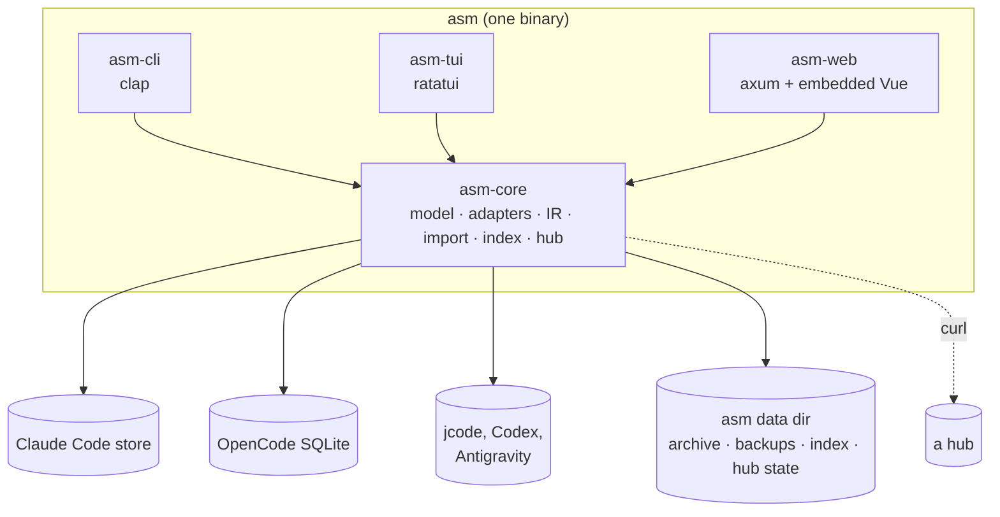

| Crate | Role |
|---|---|
| `asm-core` | Domain model, one adapter per agent, the Session IR, the import engine, the search index, hub store/client/daemon. **Synchronous, with no UI dependencies** — it must not depend on tokio, axum, clap or anyhow. |
| `asm-cli` | The clap frontend: parsing, tables, exit codes. |
| `asm-tui` | The ratatui terminal UI. A worker thread does the slow reads; the UI thread only draws. |
| `asm-web` | An axum API plus the Vue frontend, embedded at compile time. Also serves the hub's HTTP routes (`asm hub serve`) on a separate router. |
| `asm` | The single binary that wires frontends to the core. |

## One core, three frontends

Anything a frontend can do, it does by calling the core, so the three cannot disagree. The shared vocabulary lives in the core too: the sync-state labels and hints (`RowState::label/hint/action`), the bulk-action reports, the daemon status. The TUI and web UI render them; they do not re-derive them.

## Adapters

Each agent has an adapter that knows how to **list**, **read** and — where a sanctioned path exists — **write** its sessions. The adapters declare their *capabilities*, which is what the UIs grey out and `asm doctor` reports. An agent without a sanctioned write path is read-only; asm does not rewrite another tool's files to change one field.

## Hub transport

The hub's HTTP client is the system `curl` (invoked with credentials on stdin), so `https://` works with the system trust store and no TLS stack is linked. The hub's HTTP routes live in `asm-web`; its store, bundling, conflict rules and the daemon loop live in `asm-core`.

## Source layout

```text
crates/asm-core   domain model, adapters, Session IR, import engine, index, hub  (no UI deps)
crates/asm-cli    clap frontend
crates/asm-tui    ratatui terminal UI
crates/asm-web    axum API + embedded Vue frontend
crates/asm        the single `asm` binary
```

For what each agent keeps on disk, see [Agent store formats](/reference/agent-formats/).
