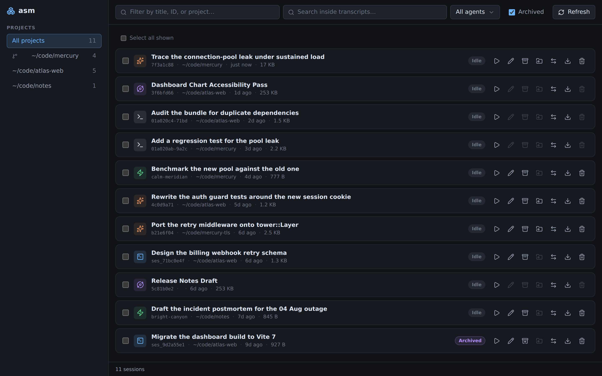
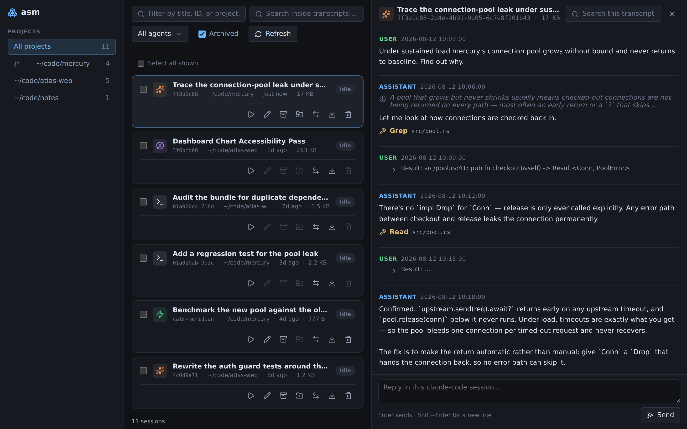
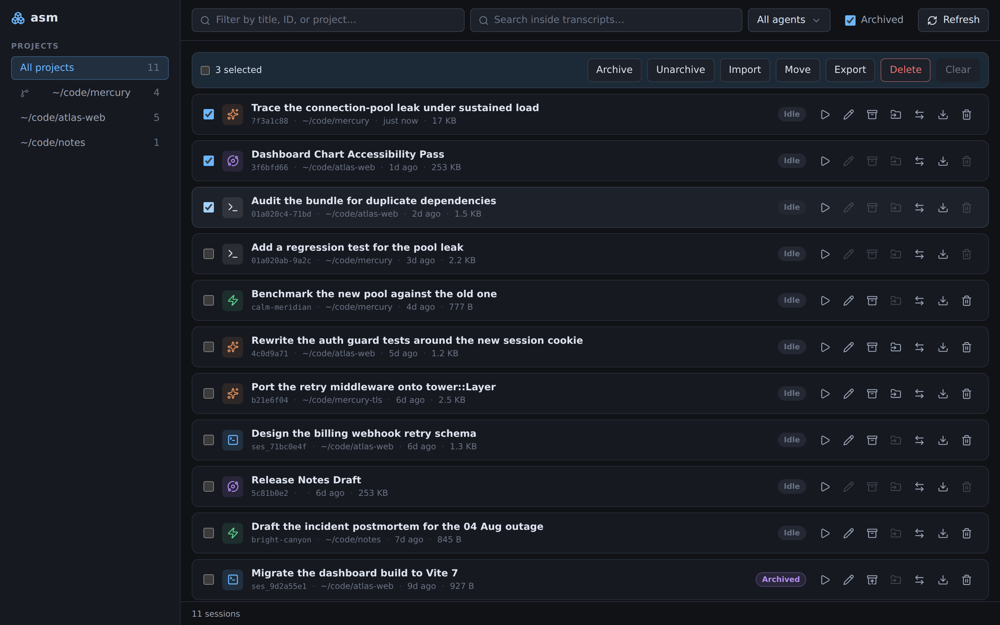
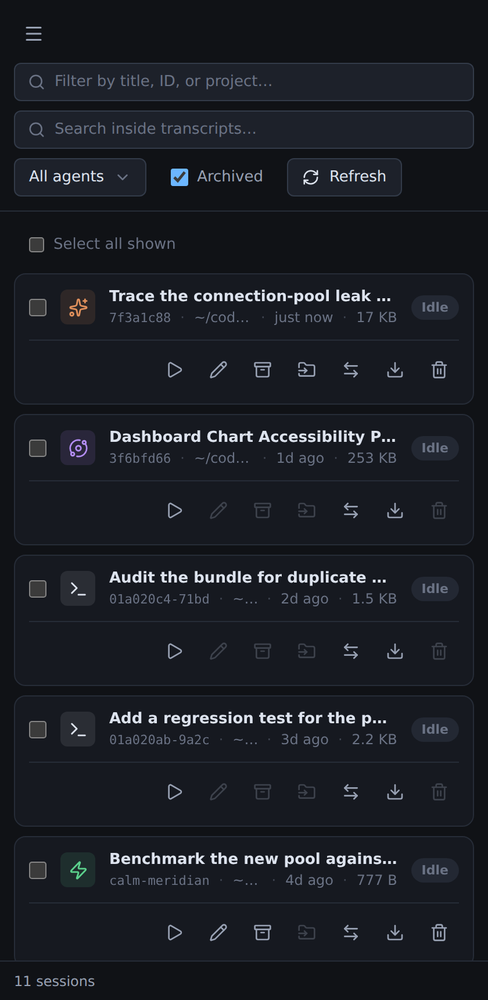
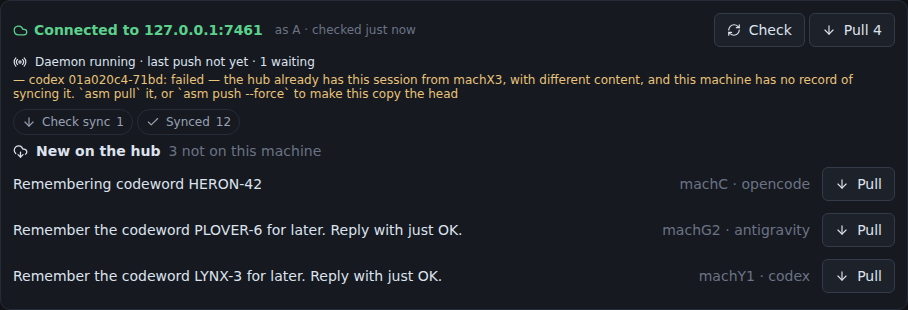

```sh
asm serve                 # http://127.0.0.1:7433
asm serve --port 8080
asm serve --host 0.0.0.0  # every interface — read the warning it prints
```




## What it does

Sessions appear as cards with the agent shown as an icon (its name is one hover away). You get per-row actions, multi-select filtering by agent, project filters in the sidebar, full-text search with highlighted snippets, and a transcript panel that renders text, reasoning, tool calls and expandable tool output. It is responsive down to a phone, where the sidebar becomes an overlay and the transcript takes the full screen.

Tick several sessions and the bar above the list archives, imports, moves, exports or deletes the whole set at once, reporting per session what did not work.

The list fills as the stores give sessions up, and says so while it is reading; the browser builds only the rows near the viewport, which is what keeps a list of thousands from taking seconds to draw.





On a phone the sidebar becomes an overlay and the transcript takes the full screen:



## The hub panel

When the machine has joined a hub, a panel above the list says how it stands:



- **Connection** — "Connected to host" with when it was last checked, or "Can't reach the hub" with the reason and what to try; **Check** / **Retry** asks again. A check runs every minute or so while the page is open.
- **Daemon** — one line: `Daemon running · last push 12s ago · 1 waiting`, or that none is running with the command to start one; a failing session's error appears beside it.
- **Filter chips** — one per sync state that has sessions. Click to narrow the list; multiple chips combine.
- **Push *n*** and **Pull *n*** — everything that needs it, in one click.
- **New on the hub** — sessions other machines pushed that this one lacks, each with a Pull button. A session of an agent that cannot be restored here is shown disabled with the reason.

Every session row also carries its sync state, in the same words as the CLI and TUI. When the hub cannot be reached, Push and Pull are disabled with the reason, and the last known states stay visible, marked old.

## Security

:::caution
The web UI has **no authentication**. It is a personal dashboard, not a service, and binds `127.0.0.1` by default.
:::

`--host` accepts any IP or hostname, and `0.0.0.0` / `::` bind every interface — but anyone who can reach that address can read every conversation and rename, move, archive, import or delete sessions, so `serve` prints a warning whenever it binds outside loopback. On a machine with a public IP, "every interface" means the internet. Mutating endpoints reject cross-origin browser requests (they require an `X-Asm-Request` header), which stops other web pages but not a direct request.

The HTTP API behind it is documented in the [web API reference](/reference/web-api/).
