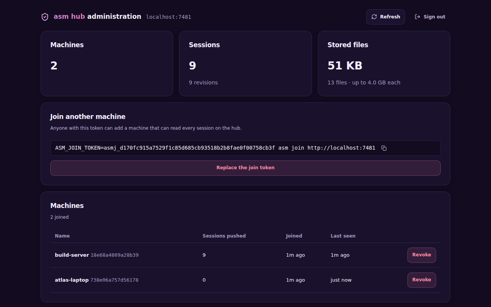

Besides the [terminal verbs](/hub/setup/#managing-machines-and-the-token), a hub has a small web page for its owner, served by `asm hub serve` at `/admin`. It manages **the hub itself**: who has joined, what is stored, and the few destructive actions that need care. It does not run anything on a machine itself and cannot act on anyone's agents; what it can do is *ask* a machine, which does it only if its owner turned [remote control](/hub/control/) on there.

## Turn it on

The admin page and API do not exist until an **admin token** does. Run this on the hub machine:

```sh
asm hub admin-token
```

```text
Admin token (shown once; running this again replaces it):

  asma_…
```

The hub keeps only a hash of it, so this is the one time it is shown; running the command again replaces it. Until one has been minted, `/admin` and `/hub/v1/admin/*` answer `401` exactly like every other path a stranger might try. Then open `http://<hub>/admin`, paste the token, and sign in. `asm hub serve` prints the admin line in its banner (`admin off` or the URL).



## What it shows and does

- **Overview** — machines, sessions, revisions, stored files and their size, and the per-file upload cap.
- **Join another machine** — the join command with a copy button, and **Replace the join token** (machines that already joined keep their access).
- **Machines** — each machine's name and id, how many sessions it pushed, when it joined and was last seen, and **Revoke**: its credential stops working at once; its sessions stay on the hub.
- **Sessions on the hub** — every session with its project, who pushed it, revisions, size and when. Search by title, id, project, machine or agent, filter by agent and machine, and sort by newest, oldest, size, revisions or title. **View transcript** opens the stored conversation in a side panel (messages with their roles and times, reasoning and tool calls collapsible, search inside the conversation); the hub renders it from its own copy, in a scratch directory, without touching any agent store. **Delete** removes every revision from the hub. Machines that have the session keep their copy and will show it as not on the hub. A session with a command or plan still going cannot be deleted (cancel it, or wait, in the Commands tab). **Send to machine…** copies the session to another machine through the hub (see **Commands**).
- **Commands** — the [remote control](/hub/control/) queue: what was asked of each machine and how it went, with **Cancel** and **Retry**. A *send* is one entry whose steps (push on one machine, then pull on the other) are a timeline. **New command** pushes or pulls on one machine, or, with **Send to another machine**, copies a session from one machine to another: the first pushes, then the second pulls exactly that copy (the first keeps its own; nothing is archived or deleted). The dialog lists only sessions already on the hub, while the CLI (`asm control send`) can name any `agent:id`. A step waiting for a machine says when it last asked the hub.
- **Storage** — **Preview** what *collecting* would remove, then remove it. Files stay on disk after a session is deleted or a push fails; collecting deletes the ones no revision names, and never one uploaded in the last hour (a push uploads before it commits).
- **Recent activity** — the hub's own record of what an administrator did.

Every destructive action asks first.

## Security

The admin token is a separate credential from the machines':

| Credential | Opens | Does not open |
|---|---|---|
| A machine's credential | the machine routes (push, pull, list) | the admin page or API |
| The join token | joining | everything else |
| The admin token | the admin page and API | the machine routes |

- It travels in an `Authorization` header, never a cookie, so no other web page can make a request that carries it. The admin API sends `Cache-Control: no-store`.
- Comparison is constant-time against a stored hash. A wrong token is one `401`.
- Every administrative action is appended to `admin.log` in the hub's store (mode `0600`) with the time, the action and its target, and shown on the page.
- The page keeps the token in `sessionStorage`, so it lasts until the tab closes.
- Like the rest of the hub, it speaks plain HTTP: the token crosses the network with each request. Use it on loopback, a network you trust, or behind HTTPS (see [Set up a hub](/hub/setup/#exposing-the-hub)).
- **The hub never calls a machine.** Remote control commands wait on the hub until a machine's daemon asks for them, and that machine runs only what its owner allowed with `asm control enable`. Nothing is delivered to a machine unasked.

The API behind the page is listed in the [web API reference](/reference/web-api/#the-hub-admin-api).
