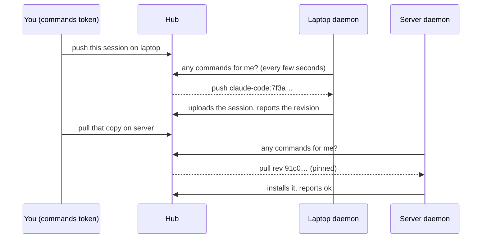

Normally every sync starts on the machine that does it: you run `asm push` or `asm pull` there, or its daemon pushes on its own. **Remote control** adds one thing: from anywhere that holds a *commands token*, you can ask a machine to push or pull one session, and follow the result. Moving a session from laptop to server becomes "push on the laptop, then pull on the server" without walking to either.



The hub never connects *to* a machine. A machine's daemon *asks* it for work, runs the commands its owner allowed, and reports back, so it works behind NAT and nothing listens on your laptop.

## Turn it on

Remote control is **off** everywhere until someone at that machine says otherwise.

1. On each machine that may be asked: `asm control enable` (add `--allow pull` to allow only pulls). It needs the [daemon](/hub/daemon/) running (`asm daemon install`). `asm control disable` turns it off again; `asm control status` says where it stands.
2. On the hub: `asm hub commands-token` prints a **commands token**, once. It can create, list, cancel and retry commands — nothing else: not the admin page, not anyone's sessions. Keep it where you keep the join token.
3. Anywhere that can reach the hub: `export ASM_HUB_COMMANDS_TOKEN=asmk_…` (and `ASM_HUB_URL` if this machine has not joined the hub).

## Ask a machine

```text
asm control push <machine> <session>      # the machine uploads the session to the hub
asm control pull <machine> <session>      # the machine installs the hub's copy
asm control jobs                          # recent commands, newest first
asm control show <id>   cancel <id>   retry <id>
```

`--wait` follows the command until it ends. `<session>` is `agent:id` (or anything on the hub that names it); `<machine>` is its name or id. A pull installs the copy **exactly as the hub holds it now**, and `--from <machine>` (default: whoever pushed that copy) is checked — if the hub's current copy was pushed by someone else, the command is refused instead of installing a surprise.

The admin page's **Commands** tab shows the same queue with a state for every step, **Cancel** and **Retry**, and a **New command** form; each machine on the **Machines** tab says whether remote control is on and when it last asked.

## Moving a session

```text
asm control push laptop claude-code:7f3a1c88 --wait
asm control pull server claude-code:7f3a1c88 --wait
```

The second command is created only after the first succeeded, and installs the very revision the first one produced, even if a third machine pushes in between (its next push is then refused as based on an older copy, instead of silently replacing the newer one). Neither step deletes or archives anything: the laptop keeps its copy. Chaining the steps into one `move` that waits for each and then archives the source is the next step on this feature.

## What a command can and cannot do

- **Two verbs only: push and pull.** A command is a typed record — an operation, an agent, a session id, a revision. It carries no path, no shell, no arguments the machine has to interpret.
- **The machine decides.** It re-validates everything, runs only what `asm control enable` allowed, and refuses a session that is running, like any pull.
- **A pull never chooses where to install.** A session new to the machine is installed where the pusher's project path lands under *this* home folder, and only if that folder exists and is not hidden (`~/.ssh`, `~/.config` …). Anything else is refused with `no_dir`; pull it by hand with `--project-dir`.
- **Nothing runs unattended that you did not turn on, and nothing is deleted.** The worst a stolen commands token can do is ask machines that opted in to push or pull sessions the hub already holds.
- **One command per session at a time**, at most 20 waiting per machine, and a command nobody picks up expires after 7 days.
- **Every state change is logged** (`commands.log` in the hub's directory), without the machine's free-text detail.

A pull that overwrites an older copy of a session (OpenCode and jcode keep rows, not a log) backs the old one up first and says so in the result.

## Why a command ended

| State | Meaning |
|---|---|
| `queued` | Waiting for the machine to ask. |
| `running` | The machine took it (it has ten minutes before the hub offers it again). |
| `ok` | Done. `already_applied` / `in_sync` mean there was nothing to do. |
| `blocked` | The machine refused or could not: the result says why. Never retried by itself. |
| `cancelled` | Stopped before it ran. A running command asked to cancel may still finish, and shows its real result. |
| `expired` | Nobody picked it up in time (the machine was off). **Retry** queues it again. |

| Code | What to do |
|---|---|
| `diverged` | Both machines changed the session. Resolve it on a machine, or push with `--force` there. |
| `ahead` | That machine's copy is newer than the one being pulled. |
| `live` | The session is running on that machine. Close it and retry. |
| `no_dir` | The project folder is missing there, or outside its home folder. Pull it once by hand with `--project-dir`. |
| `not_restorable` | That agent's sessions cannot be restored onto a machine. |
| `hub_newer` | The hub has a newer copy from another machine. Pull it first. |
| `conflict` | Another machine pushed at the same moment. Retry. |
| `remote_off` | Remote control is off on that machine. |
| `unsupported` | That machine's asm is too old for the command. |

## Limits

- A machine answers only while its daemon runs, within a few seconds. A command can outlast the daemon's poll (a big upload): it simply polls again afterwards, and the hub accepts a late result.
- Old daemons never ask, and the hub refuses to queue for a machine that never reported remote control. A new daemon talking to an older hub stays quiet and tries again in an hour.
- `asm control enable` refuses a hub reached over plain HTTP outside a private network.
