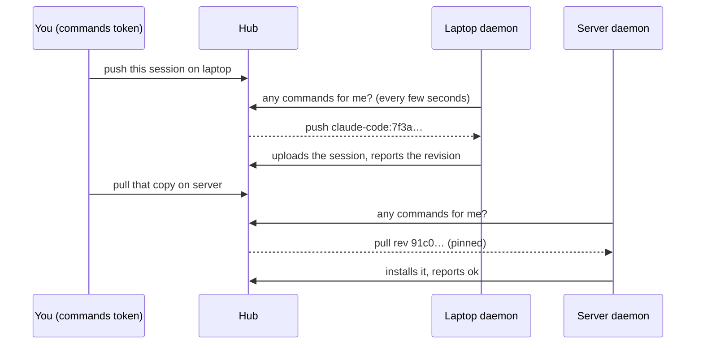

Normally every sync starts on the machine that does it: you run `asm push` or `asm pull` there, or its daemon pushes on its own. **Remote control** adds one thing: from anywhere that holds a *commands token*, you can ask a machine to push or pull one session, and follow the result. Sending a session from laptop to server becomes "push on the laptop, then pull on the server" without walking to either, and *moving* it adds a last step: archive it on the laptop once the server has it.



The hub never connects *to* a machine. A machine's daemon *asks* it for work, runs the commands its owner allowed, and reports back, so it works behind NAT and nothing listens on your laptop.

## Turn it on

Remote control is **off** everywhere until someone at that machine says otherwise.

1. On each machine that may be asked: `asm control enable` (add `--allow pull` to allow only pulls). It needs the [daemon](/hub/daemon/) running (`asm daemon install`). `asm control disable` turns it off again; `asm control status` says where it stands. `archive` is a third operation that is **never on by default**: only a machine you pass `--allow push,pull,archive` to can be the source of a [move](#moving-a-session).
2. On the hub: `asm hub commands-token` prints a **commands token**, once. It can create, list, cancel and retry commands — nothing else: not the admin page, not anyone's sessions. Keep it where you keep the join token.
3. Anywhere that can reach the hub: `export ASM_HUB_COMMANDS_TOKEN=asmk_…` (and `ASM_HUB_URL` if this machine has not joined the hub).

## Ask a machine

```text
asm control push <machine> <session>      # the machine uploads the session to the hub
asm control pull <machine> <session>      # the machine installs the hub's copy
asm control jobs                          # recent commands, newest first
asm control send <session> --from <machine> --to <machine>   # push there, then pull here: see below
asm control move <session> --from <machine> --to <machine>   # send, then archive the source: see below
asm control show <id>   cancel <id>   retry <id>
```

`--wait` follows the command until it ends (up to ten minutes; the exit status is the same for a move: see below). `<session>` is `agent:id` (or anything on the hub that names it); `<machine>` is its name or id. A pull installs the copy **exactly as the hub holds it now**, and `--from <machine>` (default: whoever pushed that copy) is checked — if the hub's current copy was pushed by someone else, the command is refused instead of installing a surprise.

The admin page's **Commands** tab shows the same queue with a state for every step, **Cancel** and **Retry**, and a **New command** form; each machine on the **Machines** tab says whether remote control is on and when it last asked. A step still waiting for its machine says when that machine last asked the hub, and warns if it has been silent for more than two minutes (its daemon is off or the machine is offline: the step runs when it is back). A long result is cut to three lines; **Show more** opens the rest.

### Exit status of `--wait`

`--wait` is for scripts too, so it ends with a status of its own. It works for `push`, `pull`, `send` and `move`.

| Status | Meaning |
|---|---|
| `0` | The command (or every step of the plan) succeeded. |
| `1` | It ended without succeeding (blocked, cancelled or expired), or the command was refused (a bad token, a session that is busy, two machines the same) — the message says which. |
| `2` | Still going after ten minutes. The command is not affected; the message names the step and the machine it waits for (and, for a move that has not reached its archive, says the source keeps its session and nothing has been archived). A step nobody picks up stays queued until that machine's daemon asks, and expires after 7 days. |
| `3` | The hub could not be reached. A poll that fails (network, a hub restarting) is tried again five times, two seconds apart, before giving up. |

While it waits (and not with `--json`), `--wait` says on stderr when a step starts or is picked up, and prints each step's result as it ends.

## Sending a session to another machine

```text
asm control send claude-code:7f3a1c88 --from laptop --to server --wait
```

This is one **plan** of two steps: a push on `laptop`, then a pull on `server`. The second step is `pending` and no machine is ever offered it; it is queued only after the first one succeeded, and it installs the very revision that push produced (the hub copies it from the push's result, after checking it is really on the hub), even if a third machine pushes in between. That later push is then refused as based on an older copy, instead of silently replacing the newer one. `--from` defaults to whoever pushed the hub's current copy, and `send` refuses if that is the machine in `--to`: the copy you want to send is then on the other machine, so name it with `--from`. `--exact` is the push's `--exact`. The CLI can name any `agent:id`; the admin page can only pick sessions already on the hub.

### From the admin page

On the **Sessions** tab, **Send to machine…** on a session opens the **New command** dialog with the session chosen and the action set to **Send to another machine**; the same action is in **Commands → New command** (there you pick the session too, from those already on the hub). Choose **Push from** and **Pull to** (two different machines that have remote control on; each list greys out the other's choice) and **Send a copy**. The **Commands** tab then shows the plan as one entry with its steps as a timeline.

`asm control jobs` groups a plan's steps under it, `asm control show <plan id>` prints them as a timeline, and `cancel` and `retry` take a plan id as well as a command id. `--wait` follows the plan until every step has ended (up to ten minutes), prints each step's result, and exits 0 only if the whole plan is `ok` (other statuses: see above). When a plan ends without succeeding it says where: ``step 2 stopped; earlier steps stay done. `asm control retry <plan id>` queues step 2 again.``, followed by what to do about the step's code (the table below).

- If a step does not succeed (the machine refused, it expired, you cancelled it), the steps waiting on it are cancelled as *skipped*, with the detail `step 1 did not succeed`, and the plan is `blocked`, `cancelled` or `expired`. **Retry** queues the step that did not succeed again, with the same checks as when the plan was made, and puts the skipped steps back to waiting. (The one exception is a move's archive that ended `changed_since_move`: it is not offered again, see below.)
- Cancelling a plan cancels every step that has not run. A step already running may still finish, and shows its real result; the steps after it do not run. If the push finishes after all, the pull stays skipped (`cancelled with the plan before step 1 finished`) and the plan can be retried from it: **Retry** queues the pull, which installs the copy that push produced.
- A plan is refused if the two machines are the same, if either has not turned on remote control for its part, if another command or plan for the session is still going, or if a machine's queue is full. All the steps of a plan count as one command for the session, and the hub will not delete that session from under it.

**This copies; it does not move.** Nothing is deleted or archived: the laptop keeps its copy, and a session open on the server stays open. To hand a session over so it lives on one machine only, move it.

## Moving a session

```text
asm control move claude-code:7f3a1c88 --from laptop --to server --wait
```

A **move** is a plan of three steps, in this order, each starting only after the one before it succeeded:

1. **Push on `laptop`**, always `--exact`: the hub must hold exactly the copy the laptop has.
2. **Pull on `server`** of exactly that revision (a plan's pull is pinned, as in a send).
3. **Archive on `laptop`.** The session leaves the laptop's list but its files are kept: `asm unarchive <session>` there brings it back. Nothing is deleted, on either machine or on the hub.

Archive is the one step that hides something, so it is guarded three ways. They are different kinds of guard: the first protects you against **accidents**, the second is the **owner's** say, the third is the **machine's own proof**.

| Guard | Where | What it does |
|---|---|---|
| **You confirm it** | When the plan is made | `asm control move` looks both machines up first (a name that is unknown or ambiguous fails before anything is asked), then prints what will happen with the resolved names (*move claude-code:7f3a…: push from laptop, pull on server, then archive on laptop — nothing is deleted; asm unarchive brings it back*) and asks `Continue? [y/N]`. With no terminal it refuses unless you pass `--yes`. Underneath, the hub only makes a move when the request carries `confirm_archive` set to the **source machine's id**: a name, the destination's id or nothing is refused with a `400` that names the id to set. The admin page asks for the same with a required checkbox (the **Move the session** button stays disabled until it is ticked). This stops a slip of the keyboard or a script that was meant to send; it is **not** a defence against a holder of the commands token, who can read the id out of that same `400`. |
| **Its owner allowed it** | On the source machine | `archive` is not in the default allow list. The hub refuses a move whose source did not enable it (`laptop does not allow archive commands`), and the source's daemon refuses the step if the owner took it away meanwhile. |
| **It is proved at the moment it runs** | On the source machine | The order *pull before archive* is enforced by the hub: the archive step is never offered until the pull succeeded. On top of that the **machine** proves two things before it archives: that the session is **unchanged since the copy that was sent** (what is on disk now, the transcript and the sidecar files that belong to it, is what it last synced), and that **the hub still holds that copy** (its record of the last sync names the very revision the pull installed). If either is false, nothing is archived: the step ends `changed_since_move`. |

A machine also reports, with every poll, the agents it has installed that cannot archive (`no_archive`: OpenCode 2.x has no archive). The hub refuses to plan a move away from it for those at all (`laptop cannot archive opencode sessions (OpenCode 2.x has no archive); use send instead`), so the copy is never made for an archive that could not follow; a send works. At run time the source also refuses a session that is running (`live`), an agent whose sessions cannot be archived (`not_archivable`), and a jcode session with turns still in its journal (resume it once so it writes them: `not_archivable`). A session that is already archived there counts as done (`already_applied`).

### How far a move can reach

Whoever holds a commands token can start a move, so what bounds it is not the confirmation but this:

- only a machine whose **owner opted into archive** (`--allow push,pull,archive`) can be the source, and only on sessions the token holder can name;
- at most **10 plans at once per source machine** (a machine's queue holds 20 steps, and a move puts two of them on its source);
- it is **reversible**: `asm unarchive` on the source brings the session back, and the destination keeps the copy it pulled;
- **nothing is deleted**, on either machine or on the hub.

If something goes wrong:

- **Close the session on the source before you start a move.** A running session makes the archive step stop with `live`, and a session you keep working in after the push changes it (see the next point).
- **Push or pull does not succeed.** The archive step is cancelled as *skipped* (`step 2 did not succeed`) and nothing is archived: the laptop's session is exactly as it was. Fix the cause and `retry` the plan; it continues from the step that stopped.
- **The source changed after the copy (`changed_since_move`).** The session was continued on the source after the copy that was sent, so it was not archived. The destination has the sent copy and the source has newer work. There is **no Retry** for this step (the machine's record of the last sync will not match until a new push, so asking again can only fail again, and `send` copies without archiving): to move the current state, **run the move again**. `asm control move` makes a new plan, which is allowed because a blocked plan is final; the pull on the destination is then refused as diverged if the destination continued the session too, so decide which copy to keep first. In the admin page, **Move to machine…** is offered again on the session.
- **The session is running on the source (`live`).** Close it *without continuing it*, then Retry. If you continue it, run the move again.
- **The destination has been offline for days.** Step 2 stays queued until its daemon asks, and expires after 7 days; step 3 shows *Not started: laptop keeps its session until step 2 succeeds; nothing has been archived.* The laptop's session is untouched the whole time. When the destination is back the pull runs, then the archive; if it expired, Retry queues it again, and if you gave up, cancel the plan.
- **Cancelling a plan** cancels every step that has not run; the archive will not run unless it has already started (a step already running may still finish). `retry` picks it up from the first step that did not succeed.
- **The source is offline or never asks.** The archive stays queued and expires after 7 days (`expired`); the destination keeps its copy. Retry it once the machine is back.
- **Moving back and forth.** Moving a session to the server and later back to the laptop: the laptop still has the session *archived* from the first move, which hides whatever is pulled onto it, so the pull ends `archived_here` and installs nothing. Run `asm unarchive <session>` on the laptop (for an agent asm cannot unarchive, such as Codex, restore it in that agent), then Retry; the pull then brings it up to the newer copy like any other pull. A live copy that sits beside an older archived one ends an archive step as `not_archivable` (*an older archived copy of this session is in asm's archive on laptop and in the way: remove that copy from the archive if you no longer need it, then retry*; `asm unarchive` cannot clear it, because the session is already live there).
- **Undo it.** On the source machine, `asm unarchive <session>`, or **Unarchive** in the web UI. The copy on the destination is unaffected. A finished `asm control move` prints the way back: `laptop archived claude-code:7f3a…; undo with asm unarchive claude-code:7f3a… on laptop.`

**Send or move?** *Send* copies: both machines keep the session and may diverge. *Move* copies and then archives the source, so one machine has it live and the other keeps an archived copy it can restore. In the admin page, **Move to machine…** on a Sessions row, or **Move to another machine** in **Commands → New command** (the source must allow `archive`: a machine that does not is greyed out as *archive is off*, a persistent hint under **Push from** says to run `asm control enable --allow push,pull,archive` there, and an older machine whose asm cannot archive says *needs a newer asm*).

## What a command can and cannot do

- **Three verbs only: push, pull and, as the last step of a move, archive.** A command is a typed record — an operation, an agent, a session id, a revision. It carries no path, no shell, no arguments the machine has to interpret. Archive cannot be asked for on its own, and a machine runs it only if its owner passed `--allow archive`.
- **The machine decides.** It re-validates everything, runs only what `asm control enable` allowed, and refuses a session that is running, like any pull.
- **A pull never chooses where to install.** A session new to the machine is installed where the pusher's project path lands under *this* home folder, and only if that folder exists and is not hidden (`~/.ssh`, `~/.config` …). Anything else is refused with `no_dir`; pull it by hand with `--project-dir`.
- **Nothing runs unattended that you did not turn on, and nothing is deleted.** The worst a stolen commands token can do is ask machines that opted in to push or pull sessions the hub already holds — and, for the few that also opted into `archive`, archive a session that was just copied to another machine (reversible with `asm unarchive`). The id they have to give is a guard against accidents, not against them; the bound is [how far a move can reach](#how-far-a-move-can-reach), and the machine refuses the archive unless the session is unchanged since the copy and the hub still holds it.
- **One command per session at a time** (all the steps of a plan count as one), at most 20 waiting per machine (steps still pending count), and a command nobody picks up expires after 7 days.
- **Every state change is logged** (`commands.log` in the hub's directory) with who caused it (`admin`, `commands-token`, the machine, or `hub` for a timeout) and the revision, without the machine's free-text detail. The hub stores at most 2000 commands, finished ones included, until old ones are pruned after 14 days.

A pull that overwrites an older copy of a session (OpenCode and jcode keep rows, not a log) backs the old one up first and says so in the result.

## Why a command ended

| State | Meaning |
|---|---|
| `pending` | A plan's step waiting for the one before it. Never offered to a machine. |
| `queued` | Waiting for the machine to ask. |
| `running` | The machine took it (it has ten minutes before the hub offers it again). |
| `ok` | Done. `already_applied` / `in_sync` mean there was nothing to do. |
| `blocked` | The machine refused or could not: the result says why. Never retried by itself. |
| `cancelled` | Stopped before it ran. A running command asked to cancel may still finish, and shows its real result. In a plan, also a step that never ran because an earlier one did not succeed (`skipped`). |
| `expired` | Nobody picked it up in time (the machine was off). **Retry** queues it again. |

| Code | What to do |
|---|---|
| `diverged` | A push: both machines changed the session; resolve it on that machine, or push with `--force` there. A plan's pull: the target machine has changes the sent copy does not. Decide which to keep there, then retry. (Do not force-push from the target: that would replace the hub's current copy with its divergent one.) |
| `ahead` | That machine's copy is newer than the one being pulled. |
| `live` | The session is running on that machine. Close it and retry. On a move's archive step: the session is running on the source; close it without continuing it, then Retry. If you continue it, run the move again. |
| `no_dir` | The project folder is missing there, or outside its home folder. Pull it once by hand with `--project-dir`. |
| `not_restorable` | That agent's sessions cannot be restored onto a machine. |
| `hub_newer` | The hub has a newer copy from another machine. Pull it first. |
| `conflict` | Another machine pushed at the same moment. Retry. |
| `changed_since_move` | A move's archive step: the session was continued on the source after the copy that was sent, so it was not archived. The destination has the sent copy. To move the current state, run the move again. (No Retry is offered: it could only fail again.) |
| `archived_here` | A pull onto a machine that has the session *archived*: a copy installed there would stay hidden, so nothing is installed (as when a session comes back to the machine it was moved from). Run `asm unarchive` there, then Retry. |
| `not_archivable` | This session cannot be archived on that machine: its agent has no archive, a jcode session has not yet written its turns (resume it once), or an older archived copy is in the way (remove it from asm's archive on that machine, then Retry). |
| `remote_off` | Remote control is off on that machine. |
| `unsupported` | That machine's asm is too old, or does not run this kind of command. On an archive step: that machine does not allow archive commands; run `asm control enable --allow push,pull,archive` there. |

## Limits

- A machine answers only while its daemon runs, within a few seconds. A command can outlast the daemon's poll (a big upload): it simply polls again afterwards, and the hub accepts a late result.
- Old daemons never ask, and the hub refuses to queue for a machine that never reported remote control. A new daemon talking to an older hub stays quiet and tries again in an hour.
- `asm control enable` refuses a hub reached over plain HTTP outside a private network.
