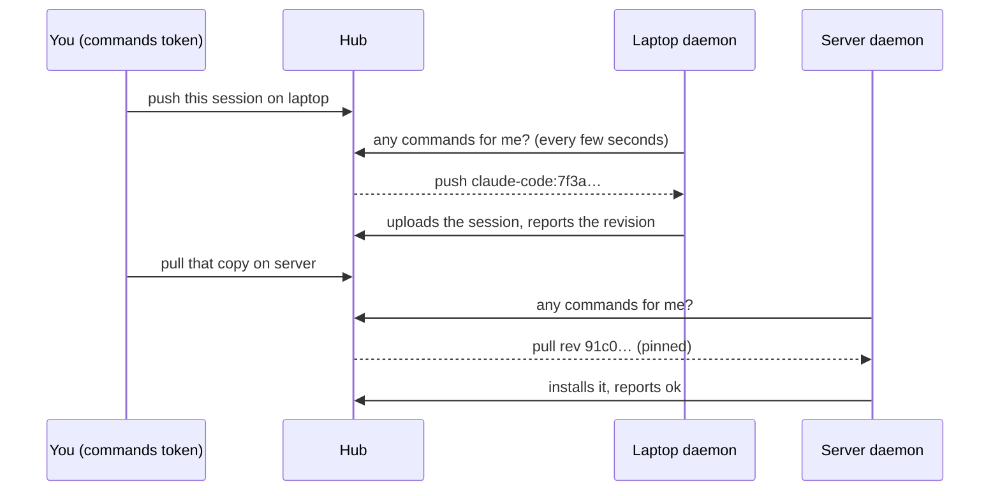

Normally every sync starts on the machine that does it: you run `asm push` or `asm pull` there, or its daemon pushes on its own. **Remote control** adds one thing: from anywhere that holds a *commands token*, you can ask a machine to push or pull one session, and follow the result. Sending a session from laptop to server becomes "push on the laptop, then pull on the server" without walking to either.



The hub never connects *to* a machine. A machine's daemon *asks* it for work, runs the commands its owner allowed, and reports back, so it works behind NAT and nothing listens on your laptop.

## Turn it on

Remote control is **off** everywhere until someone at that machine says otherwise.

1. On each machine that may be asked: `asm control enable` (add `--allow pull` to allow only pulls). It needs the [daemon](/hub/daemon/) running (`asm daemon install`). `asm control disable` turns it off again; `asm control status` says where it stands.
2. On the hub: `asm hub commands-token` prints a **commands token**, once. It can create, list, cancel and retry commands — nothing else: not the admin page, not anyone's sessions. Keep it where you keep the join token.
3. Anywhere that can reach the hub: `export ASM_HUB_COMMANDS_TOKEN=asmk_…` (and `ASM_HUB_URL` if this machine has not joined the hub).

## Ask a machine

```text
asm control push <machine> <session>      # the machine uploads the session to the hub
asm control pull <machine> <session>      # the machine installs the hub's copy
asm control jobs                          # recent commands, newest first
asm control send <session> --from <machine> --to <machine>   # push there, then pull here: see below
asm control show <id>   cancel <id>   retry <id>
```

`--wait` follows the command until it ends (up to ten minutes). `<session>` is `agent:id` (or anything on the hub that names it); `<machine>` is its name or id. A pull installs the copy **exactly as the hub holds it now**, and `--from <machine>` (default: whoever pushed that copy) is checked — if the hub's current copy was pushed by someone else, the command is refused instead of installing a surprise.

The admin page's **Commands** tab shows the same queue with a state for every step, **Cancel** and **Retry**, and a **New command** form; each machine on the **Machines** tab says whether remote control is on and when it last asked. A step still waiting for its machine says when that machine last asked the hub, and warns if it has been silent for more than two minutes (its daemon is off or the machine is offline: the step runs when it is back). A long result is cut to three lines; **Show more** opens the rest.

### Exit status of `--wait`

`--wait` is for scripts too, so it ends with a status of its own. It works for `push`, `pull` and `send`.

| Status | Meaning |
|---|---|
| `0` | The command (or every step of the plan) succeeded. |
| `1` | It ended without succeeding (blocked, cancelled or expired), or the command was refused (a bad token, a session that is busy, two machines the same) — the message says which. |
| `2` | Still going after ten minutes. The command is not affected; the message names the step and the machine it waits for. A step nobody picks up stays queued until that machine's daemon asks, and expires after 7 days. |
| `3` | The hub could not be reached. A poll that fails (network, a hub restarting) is tried again five times, two seconds apart, before giving up. |

While it waits (and not with `--json`), `--wait` says on stderr when a step starts or is picked up, and prints each step's result as it ends.

## Sending a session to another machine

```text
asm control send claude-code:7f3a1c88 --from laptop --to server --wait
```

This is one **plan** of two steps: a push on `laptop`, then a pull on `server`. The second step is `pending` and no machine is ever offered it; it is queued only after the first one succeeded, and it installs the very revision that push produced (the hub copies it from the push's result, after checking it is really on the hub), even if a third machine pushes in between. That later push is then refused as based on an older copy, instead of silently replacing the newer one. `--from` defaults to whoever pushed the hub's current copy, and `send` refuses if that is the machine in `--to`: the copy you want to send is then on the other machine, so name it with `--from`. `--exact` is the push's `--exact`. The CLI can name any `agent:id`; the admin page can only pick sessions already on the hub.

### From the admin page

On the **Sessions** tab, **Send to machine…** on a session opens the **New command** dialog with the session chosen and the action set to **Send to another machine**; the same action is in **Commands → New command** (there you pick the session too, from those already on the hub). Choose **Push from** and **Pull to** (two different machines that have remote control on; each list greys out the other's choice) and **Send a copy**. The **Commands** tab then shows the plan as one entry with its steps as a timeline.

`asm control jobs` groups a plan's steps under it, `asm control show <plan id>` prints them as a timeline, and `cancel` and `retry` take a plan id as well as a command id. `--wait` follows the plan until every step has ended (up to ten minutes), prints each step's result, and exits 0 only if the whole plan is `ok` (other statuses: see above). When a plan ends without succeeding it says where: ``step 2 stopped; earlier steps stay done. `asm control retry <plan id>` queues step 2 again.``, followed by what to do about the step's code (the table below).

- If a step does not succeed (the machine refused, it expired, you cancelled it), the steps waiting on it are cancelled as *skipped*, with the detail `step 1 did not succeed`, and the plan is `blocked`, `cancelled` or `expired`. **Retry** queues the step that did not succeed again, with the same checks as when the plan was made, and puts the skipped steps back to waiting.
- Cancelling a plan cancels every step that has not run. A step already running may still finish, and shows its real result; the steps after it do not run. If the push finishes after all, the pull stays skipped (`cancelled with the plan before step 1 finished`) and the plan can be retried from it: **Retry** queues the pull, which installs the copy that push produced.
- A plan is refused if the two machines are the same, if either has not turned on remote control for its part, if another command or plan for the session is still going, or if a machine's queue is full. All the steps of a plan count as one command for the session, and the hub will not delete that session from under it.

**This copies; it does not move.** Nothing is deleted or archived: the laptop keeps its copy, and a session open on the server stays open. Making it a true *move* by archiving the source once the pull succeeded is the next step on this feature.

## What a command can and cannot do

- **Two verbs only: push and pull.** A command is a typed record — an operation, an agent, a session id, a revision. It carries no path, no shell, no arguments the machine has to interpret.
- **The machine decides.** It re-validates everything, runs only what `asm control enable` allowed, and refuses a session that is running, like any pull.
- **A pull never chooses where to install.** A session new to the machine is installed where the pusher's project path lands under *this* home folder, and only if that folder exists and is not hidden (`~/.ssh`, `~/.config` …). Anything else is refused with `no_dir`; pull it by hand with `--project-dir`.
- **Nothing runs unattended that you did not turn on, and nothing is deleted.** The worst a stolen commands token can do is ask machines that opted in to push or pull sessions the hub already holds.
- **One command per session at a time** (all the steps of a plan count as one), at most 20 waiting per machine (steps still pending count), and a command nobody picks up expires after 7 days.
- **Every state change is logged** (`commands.log` in the hub's directory) with who caused it (`admin`, `commands-token`, the machine, or `hub` for a timeout) and the revision, without the machine's free-text detail. The hub stores at most 2000 commands, finished ones included, until old ones are pruned after 14 days.

A pull that overwrites an older copy of a session (OpenCode and jcode keep rows, not a log) backs the old one up first and says so in the result.

## Why a command ended

| State | Meaning |
|---|---|
| `pending` | A plan's step waiting for the one before it. Never offered to a machine. |
| `queued` | Waiting for the machine to ask. |
| `running` | The machine took it (it has ten minutes before the hub offers it again). |
| `ok` | Done. `already_applied` / `in_sync` mean there was nothing to do. |
| `blocked` | The machine refused or could not: the result says why. Never retried by itself. |
| `cancelled` | Stopped before it ran. A running command asked to cancel may still finish, and shows its real result. In a plan, also a step that never ran because an earlier one did not succeed (`skipped`). |
| `expired` | Nobody picked it up in time (the machine was off). **Retry** queues it again. |

| Code | What to do |
|---|---|
| `diverged` | A push: both machines changed the session; resolve it on that machine, or push with `--force` there. A plan's pull: the target machine has changes the sent copy does not. Decide which to keep there, then retry. (Do not force-push from the target: that would replace the hub's current copy with its divergent one.) |
| `ahead` | That machine's copy is newer than the one being pulled. |
| `live` | The session is running on that machine. Close it and retry. |
| `no_dir` | The project folder is missing there, or outside its home folder. Pull it once by hand with `--project-dir`. |
| `not_restorable` | That agent's sessions cannot be restored onto a machine. |
| `hub_newer` | The hub has a newer copy from another machine. Pull it first. |
| `conflict` | Another machine pushed at the same moment. Retry. |
| `remote_off` | Remote control is off on that machine. |
| `unsupported` | That machine's asm is too old for the command. |

## Limits

- A machine answers only while its daemon runs, within a few seconds. A command can outlast the daemon's poll (a big upload): it simply polls again afterwards, and the hub accepts a late result.
- Old daemons never ask, and the hub refuses to queue for a machine that never reported remote control. A new daemon talking to an older hub stays quiet and tries again in an hour.
- `asm control enable` refuses a hub reached over plain HTTP outside a private network.
