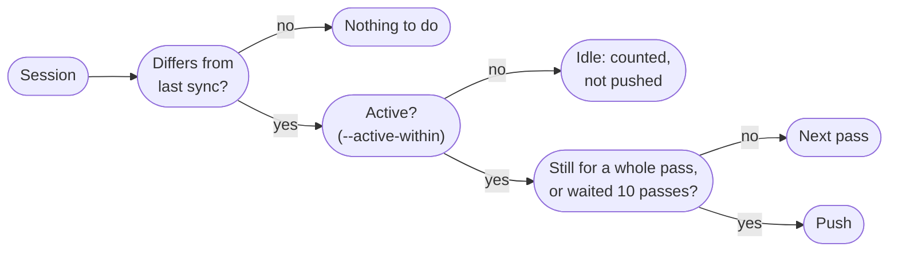

`asm daemon` pushes this machine's sessions to the hub as they change, so closing the laptop loses almost nothing. It is **push-only**: it never writes into an agent's store, so it cannot disturb a session in use, and two machines running it do not echo each other's work back. Every install is still an explicit `asm pull`.

## How a pass works

Every `--interval` seconds (default 30) the daemon looks at every session and compares a cheap content fingerprint with what was last synced:



- A session that changed and then **held still for a whole interval** is pushed, so a streamed turn goes up when it ends rather than on every write.
- One that **never holds still** (a long agent run) goes up anyway every ten passes.
- Closing the lid therefore loses up to two intervals of a session at rest, and up to ten of one still being written.

## Run it

```sh
asm daemon                        # in the foreground; ctrl-c stops it
asm daemon --interval 10
asm daemon start                  # in the background; log under the data dir
asm daemon stop
```

Only **one daemon runs per machine**: it holds a lock, and a second one is refused with the first one's pid.

## Target the sessions you are working in

By default the daemon pushes everything that differs from the hub. That is right for a laptop you want fully backed up, and noisy on a machine with years of old sessions that you never touched.

```sh
asm daemon start --active-within 30
```

With `--active-within N`, only sessions that are **live** (an agent process owns them) or that **changed in the last N minutes while the daemon was watching** are considered. Everything else that differs from the hub is counted as *idle* and left alone — it shows in `asm daemon status` and the UIs, and `asm push` still sends it on demand.

:::note
Activity is observed, not read from timestamps: the daemon notices a fingerprint change. A session already out of step when the daemon starts is idle until something changes it. If you want it backed up too, run `asm push --all` once.
:::

The global `--agent` and `--project` filters narrow the daemon as they do everything else: `asm --agent claude-code daemon`.

## Is it running?

```sh
$ asm daemon status
daemon      running (pid 1612051, up 7m)
hub         http://127.0.0.1:7461 as laptop
interval    30s
last pass   12s ago
last push   2m ago
pushes      sessions live or changed in the last 30m
waiting     1 session
idle        14 not pushed: out of step but not being worked in
totals      23 synced over 14 passes
problem     codex 01a020c4-71bd: failed — the hub already has this session from desktop, …

recent
     2m ago  claude-code 7f3a1c88: pushed 5.3 KB (4.1 KB uploaded)
```

`asm daemon status --json` is the machine-readable form. It tells apart three states:

| State | Meaning |
|---|---|
| **running** | A process holds the daemon lock and has finished a pass recently. |
| **not responding** | It holds the lock but no pass has finished for more than five intervals (at least five minutes) — hung on a stuck upload, say. |
| **not running** | Nothing holds the lock. If a status file is left behind, it shows when the daemon last ran. |

"Running" is decided by the lock, not by a pid in a file, so a crash or reused pid cannot make a dead daemon look alive. The hub's reachability is checked every pass even when there is nothing to push, so *unreachable* shows up when it happens, not on the next push.

The same information is in the UIs: the [web Hub screen](/guides/web-ui/#the-hub-view) shows it as a card, and the [TUI](/guides/tui/#the-hub) shows `daemon on` / `no daemon` in the status line and the full line in the hub view.

### Repeated failures

A session the hub refuses (diverged) is reported **once**, not every pass, and stays in `waiting` and in `problem` until you resolve it (usually `asm push --force`; see [Diverged](/hub/sync/#diverged)). A hub that cannot be reached is reported once and the daemon keeps trying.

## Run it as a service

```sh
asm daemon install                      # user service, started now, at every login
asm daemon install --interval 15 --active-within 60
asm daemon install --no-start           # write the unit, don't enable it
asm daemon uninstall
```

On Linux this writes `~/.config/systemd/user/asm-daemon.service` (honouring `XDG_CONFIG_HOME`) and runs `systemctl --user daemon-reload` and `enable --now asm-daemon`. On macOS it writes `~/Library/LaunchAgents/dev.asm.daemon.plist` and runs `launchctl load -w`. The service restarts if it dies (`Restart=on-failure`, `RestartSec=30`). Running `install` again rewrites the unit with the new flags.

The unit starts exactly the binary that ran `install`, so after `asm update` it keeps using the new one on next restart; if you move the binary, run `install` again.

:::tip
On a headless server, enable lingering so the user service runs without a login: `loginctl enable-linger $USER`.
:::

If you need a non-default store location, `ASM_DATA_DIR` is carried into the unit; other agent-specific environment variables are not.

## Losing nothing on the way to sleep

To lose nothing on Linux, push once more as the machine goes to sleep. `sleep.target` is a system unit, so this one is installed by hand:

```ini
# /etc/systemd/system/asm-push-before-sleep.service
#   systemctl enable asm-push-before-sleep
[Unit]
Description=Push asm sessions before sleeping
Before=sleep.target

[Service]
Type=oneshot
User=you
ExecStart=/home/you/.local/bin/asm push --all
TimeoutStartSec=60

[Install]
WantedBy=sleep.target
```

macOS has no equivalent hook without third-party tools; the loss window there is one interval.

## Files

| Path (under the data dir) | What |
|---|---|
| `daemon/daemon.lock` | The lock that makes "one daemon" and "running" true. |
| `daemon/status.json` | What the daemon last wrote: pid, times, counts, last 20 events. Safe to read; never edit. |
| `daemon/daemon.log` | Output of `asm daemon start`. |
