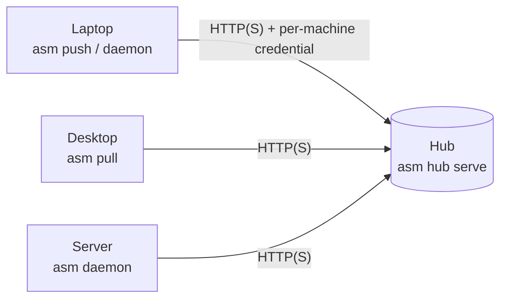

One machine runs a **hub**; the others **join** it and **push** their sessions to it, and any of them can **pull** a session another machine pushed. The hub is an archive, not a peer: it stores what machines upload and never runs an agent, so a headless server can be one. Machines see each other through it — nothing needs to reach a laptop directly.



## What crosses

Each session's **own files under its original id**. A pulled session is the same session — `claude --resume <id>` works on the other machine, not a copy with a new name. A pull lands at the same place relative to your home directory, or wherever `--project-dir` says; a session that lives somewhere else on the second machine is told so rather than duplicated.

## What the hub is not

- **Not a merge tool.** Nothing is merged and nothing is guessed. If both machines continued the same session, both are told it *diverged* and you pick. See [How sync decides](/hub/sync/).
- **Not shared storage for a team.** Every joined machine can read every session on the hub. It is one person's hub.
- **Not a transport you can't see.** `asm remote list` shows every session on the hub beside the local ones, grouped by project.

## The five-command tour

```sh
asm hub serve                     # on the hub machine; prints the join command
ASM_JOIN_TOKEN=asmj_… asm join http://hub-host:7434   # on each other machine
asm push --all                    # upload what changed
asm remote list                   # this machine and the hub, by project
asm pull 7f3a1c88                 # install a session from another machine here
```

Then [keep it current with the daemon](/hub/daemon/), or hand a single session off with `asm push <id> --move`.

## Where to read next

- [Set up a hub](/hub/setup/) — installing, binding, joining, TLS.
- [How sync decides](/hub/sync/) — states, revisions, divergence.
- [Peers](/hub/peers/) — two machines that reach each other can skip the hub for one session.
- [Restore, per agent](/hub/restore/) — what each agent's pull does.
- [The daemon](/hub/daemon/) — automatic pushing, status, running as a service.
- [Remote control](/hub/control/) — ask another machine to push or pull a session, and follow the result.
- [Security](/hub/security/) — the threat model, plainly.
