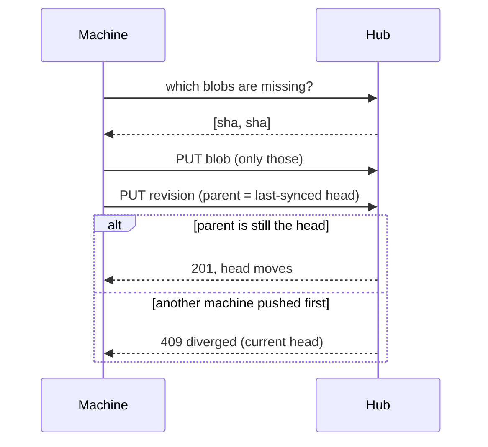

## Identity

A session is the same session when its **agent and native id** match — never because of its path or timestamps. The path only decides *where a pull lands*. Two separately started sessions in one repository are never merged, and timestamps are shown but never decide anything: clocks differ between machines, and a rename does not move a session's timestamp.

## Revisions

Each push uploads the session's files as content-addressed **blobs** (a file the hub already has is not uploaded again — a one-line change to a transcript uploads one blob), then a **revision** naming them, then moves the session's **head**. Each revision records the revision it started from (`parent_rev`).



Blobs go first, the revision second and the head last, so a crash mid-push leaves only unreferenced blobs. The hub refuses a revision whose parent is not the current head; that compare-and-swap is the entire concurrency story.

## The base

Each machine remembers, per session, the **last revision it agreed on with the hub** (`hub-state.json`). That *base* is how asm knows which side moved:

| Local vs. base | Hub head vs. base | Result |
|---|---|---|
| unchanged | unchanged | **Synced** |
| changed | unchanged | **Needs push** |
| unchanged | moved | **Needs pull** |
| changed | moved | **Diverged** |
| no record | exists | **Check sync** (pull to compare) |

## Diverged

Both machines continued the same session. Nothing is merged, and a pull of a diverged session installs nothing — it reports that it diverged. You choose which side wins:

```sh
asm push 7f3a1c88 --force     # this copy becomes the head
```

`--force` makes a new revision; the replaced copy stays on the hub as an earlier revision, so nothing is lost. To take the *other* machine's copy instead, delete the local one (`asm delete` backs it up first) and `asm pull` it.

## Pull obeys the safety model

A pull refuses a live session, never makes a second copy of an id, and only ever appends to a transcript that is a prefix of the hub's. See [Restore, per agent](/hub/restore/) for how each agent's pull works.

## What is never synced

Machine-local state stays out of the bundle: Claude's `sessions/<pid>.json`, background `jobs/`, per-project `memory/` and `~/.claude.json`; OpenCode's lock directory; jcode's `active_pids/`. Claude's `relocated` marker is machine-local state inside a shared byte stream, so it is stripped when comparing and re-derived on install.
